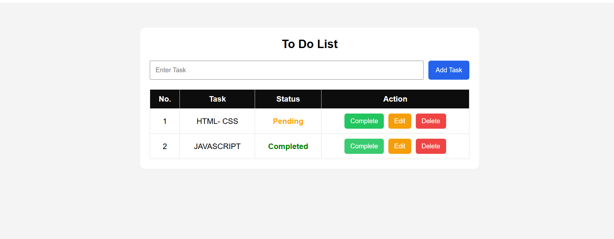

# 📝 To-Do List Application

A simple and responsive To-Do List Application built using **HTML, CSS, and JavaScript**. This application helps users manage daily tasks efficiently by allowing them to add, edit, delete, and update task status. Task data is stored using **Browser Local Storage**, ensuring data remains available even after refreshing the page.

---

## 👩‍💻 Developed By

**Dhamanda Diya Hoshiyarsingh**

🔗 GitHub Profile: https://github.com/dev-dhamandadiya

---

## 🚀 Project Repository

🔗 Repository Link:
https://github.com/dev-dhamandadiya/PR-1-HexSoftwares_To-Do-List-App.git

---

## 🎥 Project Demo Video

📹 Watch Demo:
https://drive.google.com/file/d/1dlP_7I8EfETHl0z-qCIKrZfhCmkOsEbk/view?usp=sharing

---

## 📸 Project Screenshot



---

## 🛠️ Technologies Used

* HTML5
* CSS3
* JavaScript (ES6)
* Browser Local Storage

---

## 🎯 Project Objectives

* Create a simple and user-friendly task manager.
* Allow users to add tasks.
* Allow users to edit tasks.
* Allow users to delete tasks.
* Allow users to mark tasks as completed.
* Store task data using Local Storage.
* Improve understanding of CRUD Operations and DOM Manipulation.

---

## ✨ Features

### ✅ Add Task

Users can add new tasks easily.

### ✏️ Edit Task

Existing tasks can be modified.

### 🗑️ Delete Task

Unwanted tasks can be removed.

### 🔄 Update Task Status

Users can mark tasks as Completed or Pending.

### 💾 Local Storage

Tasks remain available after page refresh.

### 📱 Responsive Design

Clean and user-friendly interface.

---

## 📂 Project Structure

```text
ToDo-List-App
│
├── index.html
├── style.css
├── script.js
├── list.png
└── README.md
```

---

## 📄 HTML Responsibilities

HTML is used to create:

* Application Structure
* Input Field
* Add Task Button
* Task Table
* Action Buttons

---

## 🎨 CSS Responsibilities

CSS is used to:

* Design the layout
* Style buttons and table
* Improve user experience
* Create responsive design
* Add colors and spacing

---

## ⚙️ JavaScript Responsibilities

JavaScript handles:

* Adding Tasks
* Editing Tasks
* Deleting Tasks
* Updating Task Status
* Displaying Tasks
* Managing Local Storage
* Dynamic DOM Updates

---

## 💾 Local Storage Implementation

### Save Data

```javascript
localStorage.setItem("tasks", JSON.stringify(tasks));
```

### Retrieve Data

```javascript
JSON.parse(localStorage.getItem("tasks")) || [];
```

### Benefits

* Data remains after refresh.
* No database required.
* Fast and lightweight solution.

---

## 🔄 CRUD Operations

### Create

Add a new task.

### Read

Display all tasks.

### Update

Edit tasks and update task status.

### Delete

Remove tasks from the list.

---

## 📚 JavaScript Methods Used

### map()

Used to update task information.

### filter()

Used to delete tasks.

### find()

Used to locate a specific task.

### forEach()

Used to display tasks dynamically.

---

## 🎓 Learning Outcomes

Through this project, I learned:

* DOM Manipulation
* Event Handling
* CRUD Operations
* Local Storage
* JavaScript Array Methods
* Dynamic UI Updates
* Frontend Development Fundamentals

---

## ✅ Conclusion

The To-Do List Application is a beginner-friendly project that demonstrates the practical use of HTML, CSS, JavaScript, CRUD Operations, and Local Storage. It provides an efficient way to manage daily tasks while strengthening frontend development skills.

---

⭐ If you found this project useful, feel free to star the repository and share your feedback.
